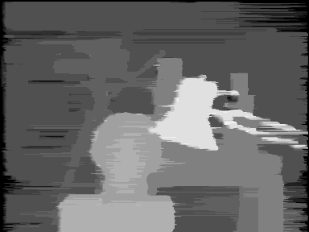
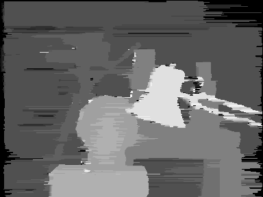

# Stereo Matching using Dynamic Programming (Optimized)
An optimized Matlab implementation of Dynamic Programming for stereo matching that **focuses on speed** with a small improvement for better results. It uses matrix operations and other techniques to make the program run even faster.

## Input Image
The Tsukuba stereo image that used as input.

   

## Output Image
The disparity map that created at the output.

   

## Output Image (Long Jumps)
The disparity map when long disparity jumps are allowed.

   

